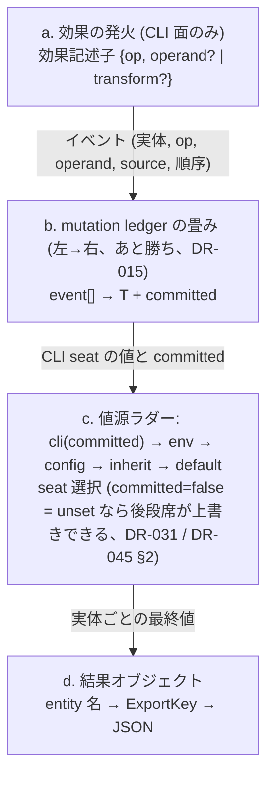
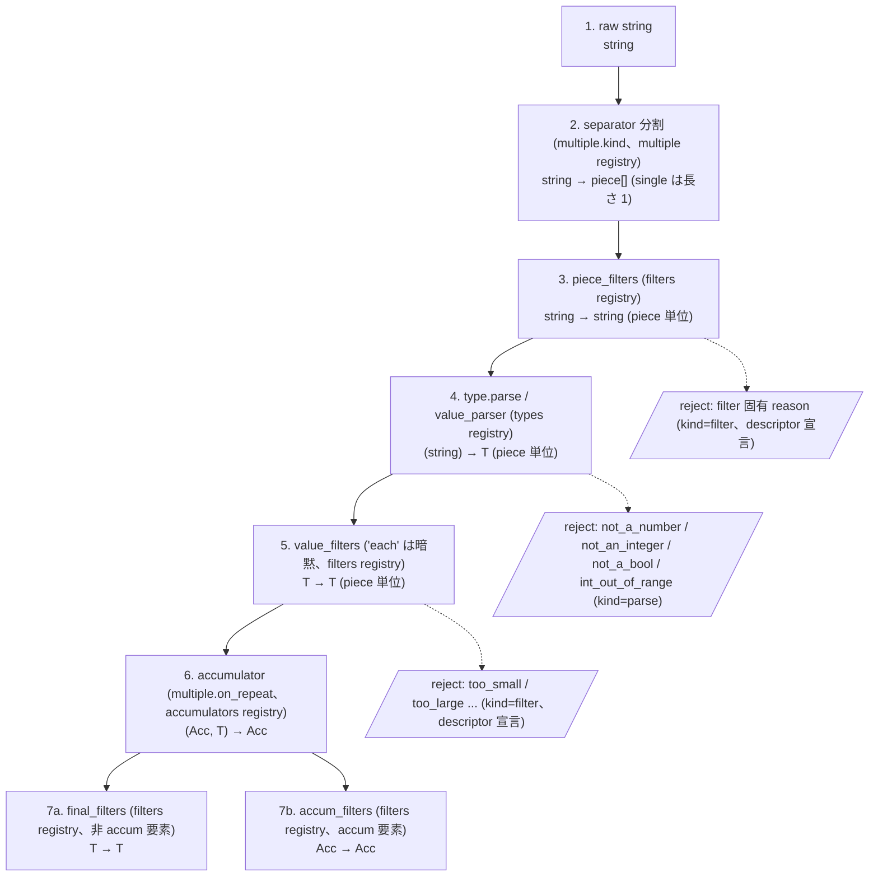

# kuu 値パイプライン — filters / effects / registry の全体図

> 本書は値が argv / env / config から結果オブジェクトに届くまでの処理順・データフロー・各段の入出力型を、
> DR-009 / DR-010 / DR-015 / DR-031 / DR-036 / DR-045 / DR-052 / DR-061 / DR-066 / DR-073 / DR-074 / DR-075 /
> DR-076 / DR-077 に散在するパイプライン仕様の説明用集約である。**各 DR が正本**であり、本書は学習・監査
> のために 1 箇所へまとめたものにすぎない。改訂は各 DR の波及として行い、本書だけ書き換えて済ませない。
> LOWERING.md 冒頭の derived 宣言と同型の位置づけ。

## 0. 記法

- **フロー図** は mermaid flowchart。矢印上に運ばれるデータの型を注記
- **型記法**: `string` / `T` / `T[]` / `Acc` などの純粋型記法。文脈依存の型は都度定義
- **DR ref** は各節タイトルとテキスト中に付記 — 個別の記述の一次資料は該当 DR 本文
- **registry 参照** は `<registry>` の表記 (例: `<filters>`) — 名前で解決される実体

## 1. 値の一生 — 字句層は値源非依存、効果は CLI 発火の関心

> **由来 DR**: DR-009 (filter chain 3 段) / DR-015 (mutation ledger) / DR-031 (値源ラダー) / DR-045 (効果) / DR-077 (update 効果と字句層の値源非依存)

どの値源から来た文字列も**同じ字句層** (parser + filters、§2) を通る。値源ごとに違うのは「入口」と「効果 (ledger イベント) を積むかどうか」だけ。CLI 発火だけが効果 (§3) を生む — env / config / default は値のみを供給する。

### 1.1 4 つの値源 (入口)

| 値源 | 入口 | 実体 |
|---|---|---|
| **CLI argv** | matcher / exact が照合・消費 → 消費した生文字列、または DSL 固定値 (`:set:true` の "true")。0-token 効果 (update 等) は文字列を作らない | `string[]` |
| **env** | 環境変数名 → 文字列。count 型に `VERBOSITY=5` なら 5 を **set** (increment ではない、DR-077 §3 の核) | `<env_provider>` |
| **config** | 文字列値は字句層へ。native number は既に binary64 化 (DR-075 §5 の非対称: string 源は binary64 非経由の厳密判定、native-number 源は JSON 由来 binary64 経由) | `string | native` |
| **default** | ラダー最下段。type preset が差す (`flag` = false / `count` = 0) | `<default_fns>` |

4 値源はいずれも字句層 (§2) を通って型 `T` になる。

### 1.2 CLI 発火からセルへの適用

- **a. 効果の発火**: トリガ発火が ledger に積む — §3 の 5 op のいずれか。値形は parser 出力を operand にした `set` の縮退形
- **b. mutation ledger の畳み**: あと勝ち (DR-015)。例: `-vv --log-level 5 -v` = update, update, set, update が順に畳まれる (0 → 1 → 2 → 5 → 6)。DR-045 §1 の効果列順序は同一性成分
- **c. 値源ラダー**: cli が committed=true でセルを確定させれば下段は上書きされない。`unset` (committed=false) だけがラダーを開放して env → config → inherit → default が後勝ち可能に
- **d. 結果オブジェクト**: キーは ExportKey map (DR-052 / DR-073)。反復系は 0 発火でも `[]` (DR-051 §2b)、非反復・非必須・値源なし要素の未発火は absent (キー不在、DR-051 §1)

## 2. 字句層 — filter chain の 7 段

> **由来 DR**: DR-009 (3 段 / 7 stage) / DR-034 (pieceProcessor = pre → parse → post、separator は multiple 内属性) / DR-036 (multiple registry と collectors 統合) / DR-062 (継承二形) / DR-074 (number/bool canonical 字句) / DR-075 (int 値空間判定 + int_round) / DR-061 (configurable factory) / DR-079 (作用対象アンカー命名: piece_filters / value_filters) / DR-102 (段 7 の属性分割: final_filters / accum_filters)

1 個の生文字列が型付き最終値になるまでの 7 段。各 filter は**純粋関数** (コンテキストなし、失敗は reason 付き reject)。段 3〜5 は piece 単位 (DR-034 の pieceProcessor)。multiple 無しの要素は separator なしの長さ 1 縮退として同じ管を通る (DR-034 §6.3 相当)。段 7 は accum 要素該当性 (`multiple`/`repeat`/`separator` のいずれか、`is_accum_elem` 判定、DR-102 §1) で対象属性・型が分かれる。

### 各段の詳細

| # | 段 | 入出力 | 概要 |
|---|---|---|---|
| 1 | raw string | `string` | CLI 消費文字列 / DSL literal / env / config — 出所を問わない (DR-077 §3 の parser 値源非依存) |
| 2 | separator 分割 | `string → piece[]` | `--tag a,b,c` → `["a","b","c"]`。separator は multiple プリセットの属性 (DR-034 / DR-036)。multiple 無しは長さ 1 の `[piece]` に縮退 |
| 3 | piece_filters | `string → string` (piece 単位) | 分割後の各 piece に適用: `trim`, `regex_match:^[a-z]+$` … (DR-034 pieceProcessor の pre 相) |
| 4 | type.parse | `(string) → T` (要素単位) | canonical 字句 (DR-074 / DR-075)。configurable factory の config キー (`int_round`, `number_allow_base_prefix`) はここに効く (DR-061 §4) |
| 5 | value_filters | `T → T` (要素単位) | 検証 + 変換: `in_range:1:65535`, `non_empty` … args は全て string (引数パースと同じ手順、DR-009)。効果 op との関係: `value_filters` は cell に書かれる実値に乗る (set operand / update 適用結果)。cell 操作 op (unset/default/empty) の発火は値を書かないので適用対象が無い (DESIGN §8.3)。値源席由来の値の chain 通過は DR-049/050 が正本 |
| 6 | accumulator | `(Acc, T) → Acc` | 複数「値」の畳み: `append`, `merge`。**count の increment はここから退役し効果側へ (DR-077 §3)** — accumulator は複数「値」の畳みに純化 |
| 7a | final_filters (非 accum 要素) | `T → T` | 確定した最終値に: count の上限 `in_range` (DR-040)。**update の結果にもここが通る** (DR-077 §1)。1 属性 1 registry (scalar filter registry、DR-102) |
| 7b | accum_filters (accum 要素) | `Acc → Acc` | 累積後の配列に: `sort`, `unique` 等。1 属性 1 registry (ARRAY filter registry、DR-102)。非 accum 要素への `accum_filters` 宣言・accum 要素への `final_filters` 宣言はいずれも definition-error kind=invalid-range (DR-102 §3、accum 要素の定義は `multiple`/`repeat`/`separator` のいずれか) |

### 失敗の出口 (reason コード、DR-066)

- **段 3 reject**: filter 固有 reason (kind=`filter`、descriptor が宣言) — `regex_match` 不一致など、parse に届く前の門前払い (DR-040)
- **段 4 reject**: `not_a_number` / `not_an_integer` / `not_a_bool` / `int_out_of_range` (kind=`parse`)
- **段 5 reject**: filter 固有 reason: `too_small` / `too_large` … (kind=`filter`、descriptor が宣言、DR-066 §2)

## 3. 効果 (effect) — 発火が値セルに与える操作、5 op

> **由来 DR**: DR-011 (綴り DSL) / DR-045 (効果記述子 4 op) / DR-077 (5 op 目 = update)

綴り DSL `"<prefix>:<op>[:args...]"` と効果記述子 `{op, ...}` は同じもの (前者が wire の綴り面、後者が lowered 形)。純データで、クロージャは registry の中にだけ住む。

### 3.1 5 op 一覧

| op | operand / args | セルへの操作 | committed | 消費 |
|---|---|---|---|---|
| `set` | 消費した値 (args なし = 値スロット) or 固定 literal (args あり、字句層を通る) | operand を書く。通常の値バインドはこの縮退形 | true | 0 or 1+ |
| `update` | transform 名 + args → `<filters>` の T→T エントリ | `cell = f(old)`。組み込み: `increment` (0-arg)。`:update:add:5` のような args 付きも可 | true | 0 |
| `default` | — | default 値へ戻す (明示選択としてロック) | true | 0 |
| `unset` | — | default 値へ戻す + 「触っていない」ことに → ラダー後段が上書き可 | **false** | 0 |
| `empty` | — | コレクション (配列 / Map) を空にする | true | 0 |

### 3.2 set 経路と update 経路の比較

**set 経路 (値を取る)**:
1. トークン消費 → `string`
2. 字句層 §2 の 1〜5 段 → `T`
3. 効果 `set(T)` を ledger へ
4. 畳み後、6〜7 段 (accumulator / final_filters・accum_filters)

**update 経路 (old を変換、DR-077)**:
1. 発火のみ (0-token)
2. old `T` → transform (filters registry の T→T エントリ) → `T`
3. 適用結果は set 経路と対称に `value_filters` (段 5、each 相) → `final_filters` (段 7a、非 accum 要素の場合) を通してセルへ (DR-077 §1 「old → transform → value_filters → cell」。count の上限 `in_range` が効くのは段 7a、DR-040/DR-102)
4. **parser は関与しない** — env の `VERBOSITY=5` は set のまま (DR-077 §3 の値源非依存の核)

### 3.3 preset との関係

- `flag` = bool + default:false + `long:true` 糖衣 `[":set:true"]` (DR-076 §2)
- `count` = number + default:0 + `long:true` 糖衣 `[":update:increment"]` (DR-077 §3)

同じ綴り合成機構の 2 例 (flag = set 縮退形、count = update 縮退形)。

## 4. registry 8 区分と属性の暗黙対応

> **由来 DR**: DR-010 (7 registry + 暗黙参照) / DR-036 (multiple registry を追加して 8 区分、旧 collectors は filters に統合) / DR-061 (descriptor / configurable factory)

AST にはクロージャを持たせない — フィールド名で registry が暗黙決定され、wire には名前 + args だけが載る。各エントリは descriptor (DR-061) で owns / config / reasons / signature を宣言し、不在・不適合は definition-error (`unknown-vocab` 等、DR-054) で静的検出。

| registry | 実体のシグネチャ | 参照する属性 / 文脈 | 組み込み例 |
|---|---|---|---|
| `types` | `parse: (string) → T` + default filters + config キー | `type:` (configurable factory は `definitions.types` で config 束縛、DR-061) | `string` / `number` / `int` / `float` / `bool` |
| `filters` | `validate: T → T | reject` ／ `transform: T → T` (scalar filter registry) ／ `transform: Acc → Acc` (ARRAY filter registry) | `piece_filters:` / `value_filters:` / `final_filters:` (scalar) / `accum_filters:` (ARRAY、DR-102) / **update の transform (DR-077)** / 旧 collectors も統合済 (DR-036) | `trim` / `in_range` / `non_empty` / `regex_match` / `increment` / `unique` |
| `accumulators` | `(Acc, T) → Acc` (+ 既定 collector / separator の属性セット) | `multiple.accumulator` | `append` / `merge` |
| `multiple` | accumulator + collector + separator の糖衣プリセット | `multiple:` の文字列形 | `append` / `merge` / `set` / `map` |
| `handlers` | command 実行フック | `run` / `action` | — |
| `env_provider` | `name → string?` | `env:` | OS 環境変数 |
| `completers` | 動的補完生成 | completion 面 (DR-060 は素材まで) | — |
| `default_fns` | `() → T` (動的 default) | `default:` の関数形 | — |

## 5. IO 端点の型 早見表

| 地点 | シグネチャ | 失敗の出口 |
|---|---|---|
| matcher / exact 照合 | `token[] → 消費数 + (raw string | 発火のみ)` | 不一致 = 読みが立たない (エラーではなく枝が生えない、DR-041 §5 no prefix guard) |
| piece_filter | `string → string` (piece 単位) | reject (kind=filter) |
| type.parse | `(string) → T` | reason: `not_a_*` / `int_out_of_range` (kind=parse) |
| filter (validate) | `T → T | reject` | reason: `too_small` 等 (descriptor 宣言) |
| filter (transform) | `T → T` | — (update が参照できるのはこの signature のみ、DR-077 §2) |
| effect 適用 | `(cell, op, operand?) → cell + committed` | — |
| accumulator | `(Acc, T) → Acc` | — |
| cell_filter | `Acc → Acc | reject` | reason (kind=filter) |
| ladder → result | `seats → entity 値 → ExportKey → JSON` | `required_violated` 等 (kind=constraint、DR-047 / DR-055) |

## 参考

- 正本: `docs/decisions/` の各 DR (図中に付記) と `docs/LOWERING.md` (lowering カタログ)
- 本書は 2026-07-09 の DR-077 (update 効果 + count 正規形) までを反映
- エラー構造: `{element, argv_pos, kind, reason, message, path?}` — 詳細は DR-053 (outcome union) / DR-066 (reason 語彙 + §4 path フィールド)
- conformance fixture フォーマットは DR-065 / docs/CONFORMANCE.md、lowering fixture は DR-070
