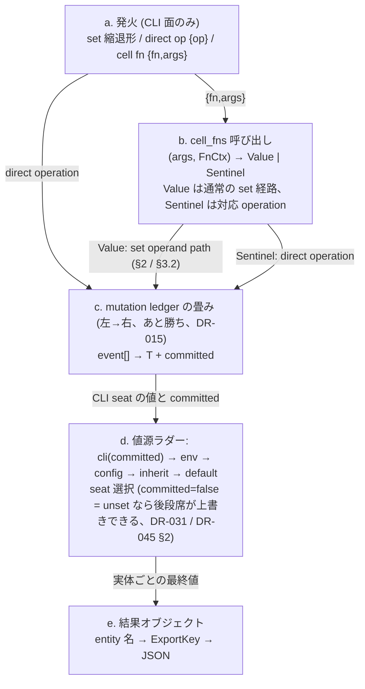
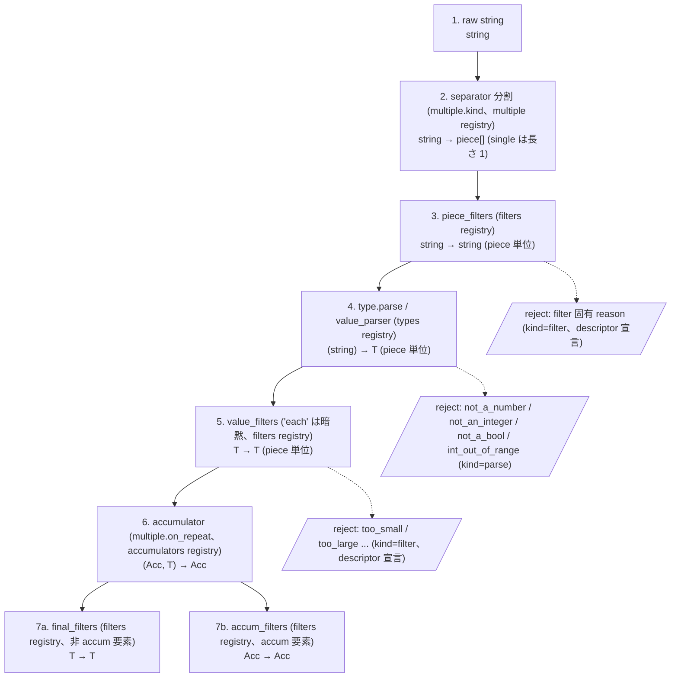

# kuu 値パイプライン — filters / effects / registry の全体図

> 本書は値が args / env / config / `cell_fns` から結果オブジェクトに届くまでの処理順・データフロー・各段の入出力型を、
> DR-009 / DR-010 / DR-015 / DR-031 / DR-036 / DR-045 / DR-052 / DR-061 / DR-066 / DR-073 / DR-074 / DR-075 /
> DR-076 / DR-102 / DR-114 に散在するパイプライン仕様の説明用集約である。特に cell fn invocation carrier、統一
> `FnCtx` (`ctx.old` を含む)、`filters` / `cell_fns` の registry 分離は DR-114 が正本である。改訂は各 DR の波及として
> 行い、本書だけ書き換えて済ませない。
> LOWERING.md 冒頭の derived 宣言と同型の位置づけ。

## 0. 記法

- **フロー図** は mermaid flowchart。矢印上に運ばれるデータの型を注記
- **型記法**: `string` / `T` / `T[]` / `Acc` などの純粋型記法。文脈依存の型は都度定義
- **DR ref** は各節タイトルとテキスト中に付記 — 個別の記述の一次資料は該当 DR 本文
- **registry 参照** は `<registry>` の表記 (例: `<filters>`) — 名前で解決される実体

## 1. 値の一生 — parser は値源非依存、発火時 cell operation は CLI 面の関心

> **由来 DR**: DR-009 (filter chain 3 段) / DR-015 (mutation ledger) / DR-031 (値源ラダー) / DR-045 (効果) / DR-114 (cell fn invocation / `FnCtx.old` / registry 分離)

どの値源から来た文字列も**同じ字句層** (parser + filters、§2) を通る。型付き `Value` を返す `cell_fns` 呼び出しは parser を再通過せず、通常の set operand として値 filter の対象になる。CLI 発火だけが cell operation (§3) を生み、env / config / inherit / default の各席は値を供給する。

### 1.1 5 つの値源 (入口)

| 値源 | 入口 | 実体 |
|---|---|---|
| **CLI args** | matcher / exact が照合・消費した生文字列、DSL 固定値 (`:set:true` の `true`)、または値スロットを消費しない `{fn,args}` cell fn invocation carrier | `string[] | {fn,args}` |
| **env** | 環境変数名 → 文字列。count 型の `VERBOSITY=5` も number として parse し、通常の set operand 5 にする | `<env_provider>` |
| **config** | 文字列値は字句層へ。native number は既に binary64 化 (DR-075 §5 の非対称: string 源は binary64 非経由の厳密判定、native-number 源は JSON 由来 binary64 経由) | `string | native` |
| **inherit** | `inherit: true` または `inherit: {"from": "other"}` が祖先 option 参照の placeholder を inherit 席へ宣言する。`cell_fns.inherit` の明示 fn 呼び出しとは別のラダー席 (DR-114 §4.1) | `inherit(name)` placeholder |
| **default** | ラダー最下段。固定値は typed internal `set(value)`、動的値は `Value` を返す `cell_fns` 呼び出しで供給する。`Sentinel` 出力の fn はこの席では definition-error `invalid-range`。type preset も固定値を差す (`flag` = false / `count` = 0) | `<cell_fns>` |

文字列値は出所によらず字句層 (§2) を通って型 `T` になる。`cell_fns` が返す型付き `Value` は通常の set operand として filter pipeline へ入り、`Sentinel` は対応する cell operation になる (DR-114 §2 / §6.1)。

### 1.2 CLI 発火からセルへの適用

- **a. 発火**: lowered 形は、値が確定済みの set 縮退形、`default` / `unset` / `empty` の direct op、または DR-114 §6.1 の `{fn,args}` carrier を使う
- **b. cell fn 呼び出し**: `cell_fns` から fn を引き、args と統一 `FnCtx` を渡す。`incr` は `ctx.old` を読み old + 1 の `Value` を返す。`Value` は通常の set operand と同じ filter pipeline へ入り、`Sentinel` は対応 operation として ledger に積む。図の Value→ledger 矢印は §2 / §3.2 の通常 set 経路を矢印内に畳んだ表記である
- **c. mutation ledger の畳み**: あと勝ち (DR-015)。例: `-vv --log-level 5 -v` の発火列は `incr, incr, set, incr`。fn 適用後の ledger event は `set(1), set(2), set(5), set(6)` となり、0 → 1 → 2 → 5 → 6 と畳まれる。効果列順序は同一性成分 (DR-045 §1)
- **d. 値源ラダー**: cli が committed=true でセルを確定させれば下段は上書きされない。`unset` (committed=false) だけがラダーを開放して env → config → inherit → default が後勝ち可能に
- **e. 結果オブジェクト**: キーは ExportKey map (DR-052 / DR-073)。反復系は 0 発火でも `[]` (DR-051 §2b)、非反復・非必須・値源なし要素の未発火は absent (キー不在、DR-051 §1)

## 2. 字句層 — filter chain の 7 段

> **由来 DR**: DR-009 (3 段 / 7 stage) / DR-034 (pieceProcessor = pre → parse → post、separator は multiple 内属性) / DR-036 (multiple registry と collectors 統合) / DR-062 (継承二形) / DR-074 (number/bool canonical 字句) / DR-075 (int 値空間判定 + int_round) / DR-061 (configurable factory) / DR-079 (作用対象アンカー命名: piece_filters / value_filters) / DR-102 (段 7 の属性分割: final_filters / accum_filters)

1 個の生文字列が型付き最終値になるまでの 7 段。filter は universal fn の filter specialization として args と `FnCtx` を受け、`FilterCtx.input()` を変換または reject する (DR-114 §3 / §7)。段 3〜5 は piece 単位 (DR-034 の pieceProcessor)。multiple 無しの要素は separator なしの長さ 1 縮退として同じ管を通る (DR-034 §6.3 相当)。段 7 は accum 要素該当性 (`multiple`/`repeat`/`separator` のいずれか、`is_accum_elem` 判定、DR-102 §1) で対象属性・型が分かれる。

### 各段の詳細

| # | 段 | 入出力 | 概要 |
|---|---|---|---|
| 1 | raw string | `string` | CLI 消費文字列 / DSL literal / env / config — parser は出所ではなく入力文字列と target type だけを見る (DR-031 / DR-114 §4.1)。cell fn が返す型付き `Value` はこの raw-string / parse 相を再通過しない |
| 2 | separator 分割 | `string → piece[]` | `--tag a,b,c` → `["a","b","c"]`。separator は multiple プリセットの属性 (DR-034 / DR-036)。multiple 無しは長さ 1 の `[piece]` に縮退 |
| 3 | piece_filters | `string → string` (piece 単位) | 分割後の各 piece に適用: `trim`, `regex_match:^[a-z]+$` … (DR-034 pieceProcessor の pre 相) |
| 4 | type.parse | `(string) → T` (要素単位) | canonical 字句 (DR-074 / DR-075)。configurable factory の config キー (`int_round`, `number_allow_base_prefix`) はここに効く (DR-061 §4) |
| 5 | value_filters | `T → T` (要素単位) | 検証 + 変換: `in_range:1:65535`, `non_empty` … args は全て string (DR-009 / DR-114 §6)。cell に書かれる実値に適用するため、parser 出力、DSL 固定値、cell fn が返した `Value` は対象になる。`Sentinel` による operation (`unset` / `default` / `empty`) は値を書かないので対象が無い |
| 6 | accumulator | `(Acc, T) → Acc` | 複数「値」の畳み: `append`, `merge`。count の現在値更新は `cell_fns.incr` が担い、accumulator は複数「値」の畳みを担う (DR-036 / DR-114 §2) |
| 7a | final_filters (非 accum 要素) | `T → T` | 確定した最終値に適用する。count の上限は `in_range` (DR-040)。cell fn が返して set operand になった `Value` も対象になる (DR-114 §6.1)。1 属性 1 registry (scalar filter registry、DR-102) |
| 7b | accum_filters (accum 要素) | `Acc → Acc` | 累積後の配列に: `sort`, `unique` 等。1 属性 1 registry (ARRAY filter registry、DR-102)。非 accum 要素への `accum_filters` 宣言・accum 要素への `final_filters` 宣言はいずれも definition-error kind=invalid-range (DR-102 §3、accum 要素の定義は `multiple`/`repeat`/`separator` のいずれか) |

### 失敗の出口 (reason コード、DR-066)

- **段 3 reject**: filter 固有 reason (kind=`filter`、descriptor が宣言) — `regex_match` 不一致など、parse に届く前の門前払い (DR-040)
- **段 4 reject**: `not_a_number` / `not_an_integer` / `not_a_bool` / `int_out_of_range` (kind=`parse`)
- **段 5 reject**: filter 固有 reason: `too_small` / `too_large` … (kind=`filter`、descriptor が宣言、DR-066 §2)

## 3. 効果 (effect) — direct cell operation と cell fn invocation

> **由来 DR**: DR-011 (variant DSL) / DR-045 (cell operation) / DR-114 §2 / §6.1 / §7 (`cell_fns`、carrier、`FnCtx.old`)

variant DSL `"<prefix>:<fn>[:args...]"` は `cell_fns` の universal fn 呼び出しである。lowering 断面では、operand が確定済みの set 縮退形、direct op、`{fn,args}` carrier の 3 形を区別する (DR-114 §6.1)。fn 実体は registry に住み、wire / lowered 形は名前と args の純データだけを持つ。

### 3.1 direct cell operation と fn carrier 一覧

| wire の fn | lowered 形 | セルへの適用 | committed | 値スロット消費 |
|---|---|---|---|---|
| `set` | `{exact, value, link}` (operand 確定済みの縮退形) | operand を書く。引数なしは値スロットを準備し、引数ありは args を `Value` として返す | true | 0 or 1+ |
| `default` | `{exact, link, effect:{op:"default"}}` | `use_default` sentinel に対応し、default placeholder へ戻す | true | 0 |
| `unset` | `{exact, link, effect:{op:"unset"}}` | unset sentinel に対応し、ラダー後段が値を供給できる状態にする | **false** | 0 |
| `empty` | `{exact, link, effect:{op:"empty"}}` | empty sentinel に対応し、array / map を空にする | true | 0 |
| 任意の cell fn | `{exact, link, effect:{fn:"<name>",args:[...]}}` | `Value` は set operand、`Sentinel` は対応 operation。`incr` は `ctx.old + 1` の `Value` を返す | 返却結果に対応 | 0 |

### 3.2 set 経路と cell fn (`incr`) 経路の比較

**set 経路 (値を取る)**:
1. トークン消費 → `string`
2. 字句層 §2 の 1〜5 段 → `T`
3. `set(T)` を ledger へ
4. 畳み後、6〜7 段 (accumulator / final_filters・accum_filters)

**cell fn 経路 (発火時に値を供給・操作する、DR-114)**:
1. 値スロットを消費せず `{fn,args}` carrier が発火
2. registry から fn を引き、args と `FnCtx` を渡す。`incr` は発火直前の `ctx.old` を読む
3. `Value` の返り値は通常の set operand として `value_filters` / `final_filters` を通って cell へ適用する。`Sentinel` は対応 operation として適用する
4. fn が返す型付き `Value` に parser は関与しない。env の `VERBOSITY=5` は文字列を number として parse → set する

### 3.3 preset との関係

- `flag` = bool + default:false。`long:true` は固定 `true` を供給し、lowered 形は set 縮退形になる (DR-076 §2)
- `count` = number + default:0。`long:true` は `cell_fns.incr` を呼び、lowered 形は `{fn:"incr",args:[]}` carrier になる (DR-114 §6.1)

どちらも同じ long trigger 合成から値セルへ link する。flag は lowering 時点で operand が確定する set 縮退形、count は発火時の `ctx.old` から operand を得る fn carrier という対称な 2 形である。

## 4. registry 8 区分と属性の暗黙対応

> **由来 DR**: DR-010 (registry + 暗黙参照) / DR-036 (multiple registry、collectors の filters 統合) / DR-061 (descriptor / configurable factory) / DR-114 §8 (`filters` / `cell_fns` 分離)

AST にはクロージャを持たせない — フィールド名と呼び出し席で registry が決まり、wire には名前 + args だけが載る。各エントリは descriptor で role / io_type / invocation / observes / reasons 等を宣言し、不在・不適合は definition-error (`unknown-vocab` 等) で静的検出する (DR-107 / DR-114 §9 / §11)。

| registry | 実体のシグネチャ | 参照する属性 / 文脈 | 組み込み例 |
|---|---|---|---|
| `types` | `parse: (string) → T` + default filters + config キー | `type:` (configurable factory は `definitions.types` で config 束縛、DR-061) | `string` / `number` / `int` / `float` / `bool` |
| `filters` | `(args, FnCtx[filter]) → Result<Value, Reason>`。入力は `FilterCtx.input()`。scalar の preserve / transform と ARRAY transform | `piece_filters:` / `value_filters:` / `final_filters:` (scalar) / `accum_filters:` (ARRAY、DR-102)。通常の filter 席から明示参照する | `trim` / `in_range` / `non_empty` / `regex_match` / `increment` / `unique` |
| `cell_fns` | `(args, FnCtx) → Result<Value | Sentinel, Reason>` | variant / default_fn の universal fn。greedy 面では `{fn,args}` effect carrier、default 席では遅延値供給として呼ぶ (DR-114 §1 / §4 / §6.1) | `set` / `incr` / `borrow` / `env` / `inherit` / `uuid` / `computed` / `default` / `unset` / `empty` |
| `accumulators` | `(Acc, T) → Acc` (+ 既定 collector / separator の属性セット) | `multiple.accumulator` | `append` / `merge` |
| `multiple` | accumulator + collector + separator の糖衣プリセット | `multiple:` の文字列形 | `append` / `merge` / `set` / `map` |
| `handlers` | command 実行フック | `run` / `action` | — |
| `env_provider` | `name → string?` | 値源ラダーの `env:` 席 | OS 環境変数 |
| `completers` | 動的補完生成 | completion 面 (DR-060 は素材まで) | — |

`cell_fns` は共通 registry だが呼び出し席の出力型適合を保つ。default 席が受け入れるのは `Value` 出力の fn だけで、`Sentinel` 出力は definition-error `invalid-range` となる。`default` / `unset` / `empty` は effect mode 専用の cell operation fn である (DR-114 §2 / §7)。

## 5. IO 端点の型 早見表

| 地点 | シグネチャ | 失敗の出口 |
|---|---|---|
| matcher / exact 照合 | `token[] → 消費数 + (raw string | 発火のみ)` | 不一致 = 読みが立たない (エラーではなく枝が生えない、DR-041 §5 no prefix guard) |
| piece_filter | `(args, FnCtx[filter input=string]) → Result<string, Reason>` (piece 単位) | reject (kind=filter) |
| type.parse | `(string) → T` | reason: `not_a_*` / `int_out_of_range` (kind=parse) |
| filter (validate) | `(args, FnCtx[filter input=T]) → Result<T, Reason>` | reason: `too_small` 等 (descriptor 宣言) |
| filter (transform) | `(args, FnCtx[filter input=T]) → Result<T, Reason>` | reasons なしの total transform なら runtime reject なし |
| cell fn invocation | `(args, FnCtx) → Result<Value | Sentinel, Reason>` | rejectable fn は descriptor 宣言 reason。`ctx.old` は発火直前の対象 cell 値 (DR-114 §7) |
| effect 適用 | direct set / `{op}` / `{fn,args}` → `(cell, operation, operand?) → cell + committed` | fn の `Value` は set operand、`Sentinel` は対応 operation (DR-114 §2 / §6.1) |
| accumulator | `(Acc, T) → Acc` | — |
| cell_filter | `Acc → Acc | reject` | reason (kind=filter) |
| ladder → result | `seats → entity 値 → ExportKey → JSON` | `required_violated` 等 (kind=constraint、DR-047 / DR-055) |

## 参考

- 正本: `docs/decisions/` の各 DR (図中に付記) と `docs/LOWERING.md` (lowering カタログ)
- universal fn、`cell_fns`、`FnCtx.old`、lowered `{fn,args}` carrier は DR-114 §1 / §2 / §6.1 / §7 / §8
- エラー構造: `{element, args_pos, kind, reason, message, path?}` — 詳細は DR-053 (outcome union) / DR-066 (reason 語彙 + §4 path フィールド)
- conformance fixture フォーマットは DR-065 / docs/CONFORMANCE.md、lowering fixture は DR-070
